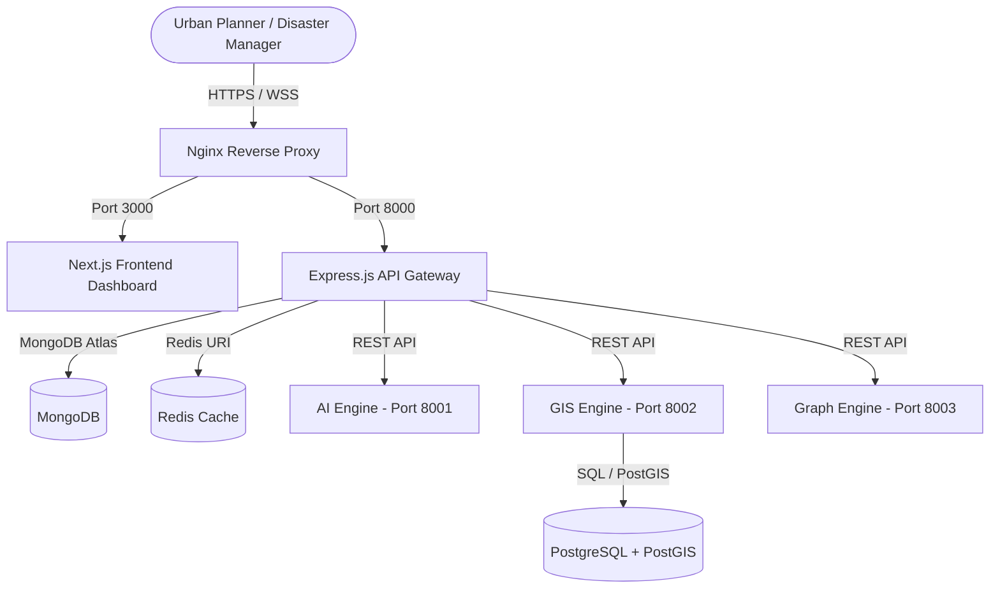
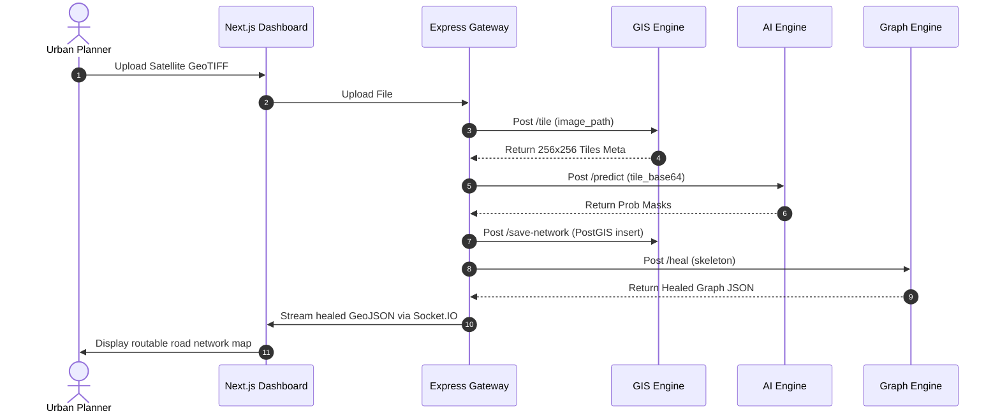

# RouteGuard AI — System Architecture
## Multi-Service Microservices Architecture

This document describes the structural design, component boundaries, and data flow of RouteGuard AI.

---

## 1. High-Level System Architecture

RouteGuard AI is structured as a decoupled, multi-service platform. This guarantees modularity, enabling independent scaling of deep learning components, graph analytics, and database services.

---

## 2. Component Diagram & Responsibilities

1. **Frontend Dashboard (Next.js + React + TS):**
   - Renders interactive GIS Leaflet maps.
   - Triggers disaster simulations (flooding, road blockages) and displays route detour overlays.
   - Displays urban resilience metrics (Resilience Index, connectivity scores, travel delays).
2. **API Gateway (Node.js + Express.js + TS):**
   - Manages client authentication, rate limiting, and simulation logging.
   - Connectes to MongoDB for metadata persistence and Redis for caching.
   - Proxies geospatial, machine learning, and topological healing queries to the Python microservices.
3. **AI Segmentation Engine (Python + PyTorch):**
   - Hosts the ViT-B/32 semantic segmenter.
   - Runs sliding-window prediction on tiled images and outputs road probability maps.
4. **GIS Processing Engine (Python + Rasterio + GeoPandas):**
   - Performs overlapping patch extraction (tiling) and CLAHE normalization on GeoTIFF sheets.
   - Rasterizes OSM vector layers to create training masks.
5. **Topological Graph Engine (Python + NetworkX):**
   - Skeletonizes binary masks into single-pixel centerline networks.
   - Runs angular MST healing to bridge disconnected road segments.
   - Computes Brandes centrality and executes target ablate simulations.

---

## 3. Data Flow Diagram (Inference & Simulation)

---

## 4. API Endpoints Schema

### Backend Gateway (Express.js)
- `GET /api/v1/cities`: List available cities.
- `GET /api/v1/cities/:cityId`: Get specific city metadata, nodes, and edges.
- `POST /api/v1/simulations/:cityId/stress-test`: Run stress ablate test.
- `POST /api/v1/simulations/:cityId/route`: Compute route detours.

### Graph Engine (Python)
- `POST /skeletonize`: Convert binary mask base64 to skeleton base64.
- `POST /heal`: Bridge gaps in skeleton base64 and return healed graph dict.
- `POST /centrality`: Compute Betweenness and Closeness centralities.
- `POST /stress-test`: Run target ablate simulations.
- `POST /route`: Calculate Dijkstra shortest paths.
