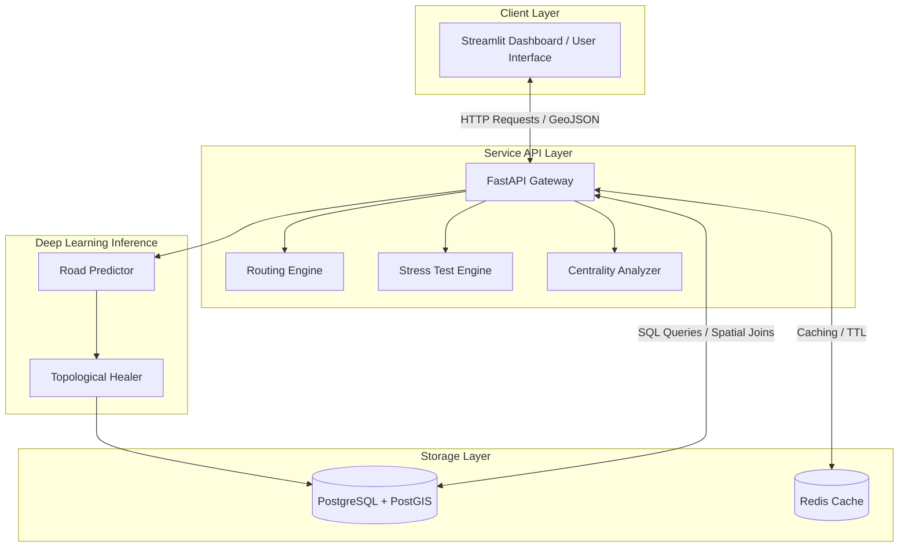
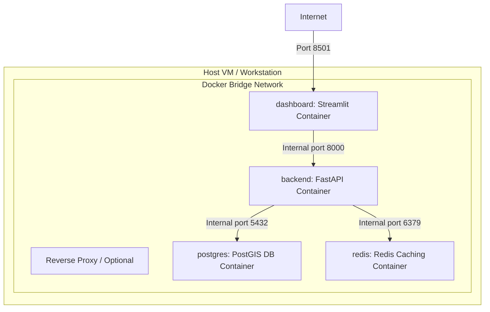

# System Architecture & Design Diagrams — Route Resilience

This document houses the design diagrams representing the system architecture, component boundaries, execution sequences, and container deployment topology.

---

## 1. System Architecture Diagram



---

## 2. Data Flow Diagram

```mermaid
flowchart LR
    A[Satellite GeoTIFF] -->|Tiling & Normalization| B[Image Tiles]
    B -->|ViT Encoder / Decoder| C[Probability Mask]
    C -->|Zhang-Suen Thinning| D[Centerline Skeleton]
    D -->|MST Angular Healing| E[Healed Skeleton]
    E -->|Graph Construction| F[Network Graph]
    F -->|Betweenness & Degree| G[Criticality Attributes]
    G -->|PostGIS INSERT| H[(Spatial DB)]
    H -->|FastAPI JSON| I[Leaflet Map Layer]
```



---

## 3. Container Deployment Diagram



---

## 4. Sequence Diagram: Upload & Process Road Network

```mermaid
sequence_id User -> UI: Upload Satellite Image
UI -> API: POST /api/v1/network/{city_id}/upload-mask (Binary File)
API -> PIL: Load & Convert to RGB
API -> Tiler: Tile Image (overlapping windows)
Tiler -> Predictor: Batch Inference (ViT Segmenter)
Predictor -> PostProcessor: CRF & Morphological Clean
PostProcessor -> Skeletons: Zhang-Suen Centerline
Skeletons -> Healer: MST & Disjoint Set Angular Heal
Healer -> DB: Insert georeferenced Nodes & Edges
DB -> API: Confirmation (Nodes & Edges Count)
API -> UI: Return Processed Summary JSON
UI -> User: Render Network Overlay & Heatmap
```

---

## 5. Component Diagram

```mermaid
component
  [Tiling Engine] ..> [Normalization & Augmentation]
  [Vision Transformer Model] ..> [Composite Losses]
  [Skeletonizer] ..> [Angular Healer]
  [NetworkX Graph API] ..> [Stress Test Simulator]
  [FastAPI Controllers] ..> [PostgreSQL / PostGIS Engine]
  [Streamlit UI Pages] ..> [Folium / Leaflet Renderer]
```
