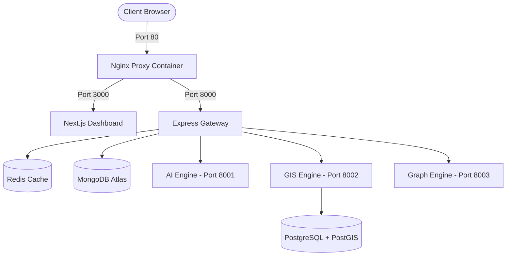

# RouteGuard AI — Deployment Plan
## Production Orchestration, Monitoring, and Backup Strategies

This document details the container deployment and production monitoring design for RouteGuard AI.

---

## 1. Container Architecture (Docker Compose)

The production environment orchestrates nine distinct Docker containers using Docker Compose. All microservices communicate over an isolated internal virtual network (`pathshield-net`).



---

## 2. Reverse Proxy Routing (Nginx)

Nginx is placed at the edge to route all incoming HTTP/WSS requests:
- **Port 80 /:** Routes to the Next.js static files and SSR server.
- **Port 80 /api/v1/:** Routes to the Express.js API Gateway endpoints.
- **Port 80 /socket.io/:** Routes WebSocket streams to Express.js.

---

## 3. Monitoring & Error Tracking

To ensure high availability in production, RouteGuard AI integrates the following observability tools:
1. **Prometheus:** Collects API request latencies, CPU/Memory utilization of Python engines, and database query durations.
2. **Grafana:** Visualizes metrics in custom dashboards, plotting metrics like Active Connections, CPU utilization during inference, and Redis cache hit ratios.
3. **Sentry:** Captures uncaught exceptions in the Express.js gateway and PyTorch segmentation loader, providing instant Slack/email notifications to DevOps teams.

---

## 4. Database Backup Strategy

To prevent data loss, the production infrastructure runs automated backup cron jobs:
- **MongoDB Backups:** Daily snapshots exported using `mongodump` and archived to Amazon S3 buckets.
- **PostGIS Spatial Backups:** Weekly PostgreSQL database dumps:
  ```bash
  pg_dump -h postgis-db -U postgres -d routeresilience -F c -b -v -f /backups/spatial_db.backup
  ```
- **Retention Policy:** Daily backups are retained for 30 days; weekly backups are retained for 90 days.
