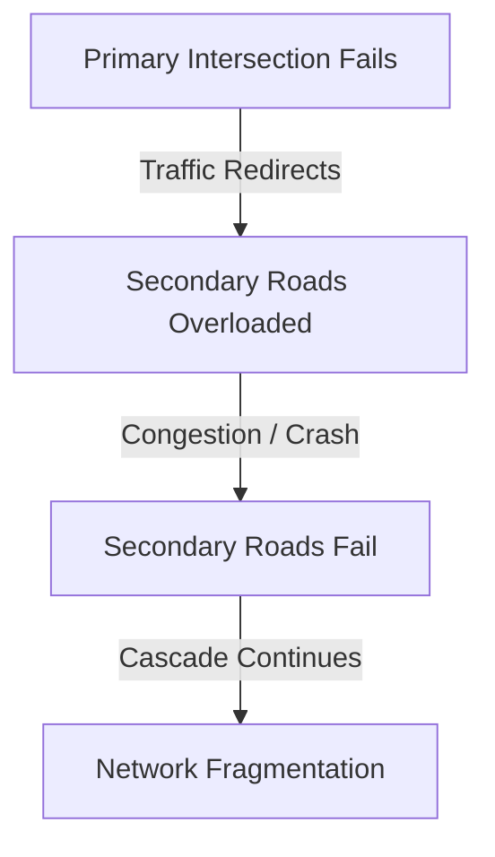

# RouteGuard AI — Disaster Engine
## Simulation Models for Infrastructure Failures and Climate Disruptions

This document details the simulation capabilities of RouteGuard AI, enabling urban planners to model disasters and assess impact.

---

## 1. Spatial Flood Inundation Simulation

Flooding is modeled by intersecting geographic boundary polygons (representing flood zones) with the road network:
- **Input:** Flood polygon bounds $[x_{\text{min}}, y_{\text{min}}, x_{\text{max}}, y_{\text{max}}]$ in WGS84.
- **Node Disabling:** All nodes whose geographic coordinates fall inside the boundary box are marked as inactive:
  $$\mathcal{V}_{\text{flooded}} = \{ n \in G \mid x_{\text{min}} \le x_n \le x_{\text{max}} \land y_{\text{min}} \le y_n \le y_{\text{max}} \}$$
- **Edge Disabling:** Any edge connected to a disabled node is automatically deactivated.
- **Impact Output:** The engine computes the new Resilience Index and lists which districts are isolated from the main city network.

---

## 2. Targeted Ablation & Bridge Collapse

Planners can simulate targeted strikes or structural failures on critical corridors (e.g. bridge collapse, highway construction closure):
1. **Single Edge/Node Ablation:** Deactivating individual nodes or edges to measure local routing detours.
2. **Alternative Route Detours:** The routing engine computes alternative detours avoiding the disabled infrastructure, returning the detour factor:
   $$\text{Detour Factor} = \frac{\text{Distance}_{\text{detour}}}{\text{Distance}_{\text{original}}}$$

---

## 3. Cascading Failure Simulation

During extreme events, the failure of a primary intersection redirects traffic to nearby secondary roads, overloading them and triggering cascading collapses.

### Cascading Failure Algorithm:
1. **Input:** Seed node $s$ representing the initial failure.
2. **Ablation:** Remove node $s$ from the active graph.
3. **Neighbor Evaluation:** List all immediate neighbors of $s$.
4. **Degree Re-computation:** Compute the degree (valency) of each neighbor in the remaining graph.
5. **Iterative Failure:** The neighbor with the highest remaining degree is selected as the next casualty (representing the node receiving the highest redirected traffic load).
6. **Repeat:** Continue for $N$ iterations, mapping the sequence of failures and graphing the exponential decay of the Resilience Index.
