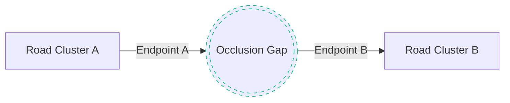

# RouteGuard AI — Graph Engine
## Centerline Skeletonization and Topological Graph Healing

This document details the spatial algorithms converting binary segmentation masks into mathematically connected road networks.

---

## 1. Centerline Skeletonization (Thinning)

Binary segmentations are often wide and irregular. To build a network graph, we must reduce the road regions to single-pixel wide centerlines:

1. **Zhang-Suen Thinning:** An iterative morphological thinning algorithm that deletes boundary pixels without changing the topological connectivity (Euler characteristic) of the objects.
2. **Feature Point Classification:**
   - For every skeleton pixel, we evaluate its 8-connected neighborhood.
   - **Endpoints (Dead Ends):** Valency (degree) $= 1$.
   - **Standard Road Pixels:** Valency (degree) $= 2$.
   - **Junctions (Intersections):** Valency (degree) $\ge 3$.

---

## 2. Topological Graph Healing Engine

When occlusions break the road mask, the resulting skeleton contains disjoint road clusters. The healing engine bridges these gaps.

### Steps in Healing:
1. **Disjoint Sets Initialization:** We initialize a Union-Find data structure where each connected component in the skeleton belongs to a distinct set.
2. **KD-Tree Query:** Find all endpoint pairs from different components within a maximum search radius (e.g. $150\text{m}$).
3. **Angular Continuity Validation:**
   - For each candidate bridge connection between Endpoint $A$ and Endpoint $B$, we estimate their local road direction vectors ($\vec{v}_A, \vec{v}_B$) by analyzing skeleton coordinates within a search radius of 10 pixels.
   - We check if the directions are compatible (i.e. they align like two ends of the same street):
     $$\theta = \arccos\left(\frac{\vec{v}_A \cdot \vec{v}_B}{\|\vec{v}_A\| \|\vec{v}_B\|}\right) \le 35^\circ$$
4. **Minimum Spanning Tree Selection:**
   - Valid bridge candidates are added as edges in a candidate graph weighted by Euclidean distance.
   - We compute the **Minimum Spanning Tree (MST)** to select the optimal, shortest set of bridges that connects all disjoint clusters without creating redundant cycles or parallel loops.
5. **Mask Reconstruction:** Selected bridges are drawn back onto the skeleton mask, creating a mathematically connected network.

---

## 3. Geographic Projection (CRS)

Standard satellite coordinates are in longitude/latitude (EPSG:4326). To compute accurate metric lengths (for travel times and routing), all node positions are projected to local **Universal Transverse Mercator (UTM)** zones:
- **Bengaluru:** UTM Zone 43N (EPSG:32643).
- **Delhi:** UTM Zone 43N (EPSG:32643).
Metric coordinates allow correct Euclidean distance weights:
$$d(u, v) = \sqrt{(x_u - x_v)^2 + (y_u - y_v)^2} \quad \text{meters}$$
