# RouteGuard AI — Model Architecture
## Vision Transformer Semantic Segmenter and Topological Losses

This document describes the neural network architecture, attention mechanisms, and composite loss functions of RouteGuard AI.

---

## 1. Network Architecture (ViT Encoder-Decoder)

We implement a Vision Transformer (ViT-B/32) encoder backbone paired with a multi-scale skip-connection decoder designed for high-resolution semantic segmentation.

```mermaid
graph LR
    Input[Image 256x256x3] --> Patches[Patch Projection 32x32]
    Patches --> Transformer[12 Transformer Blocks]
    Transformer --> Reshape[Reshape to 8x8x768]
    Reshape --> Decoder1[Deconv 16x16]
    Decoder1 --> Attention[Spatial & Channel Attention]
    Attention --> Decoder2[Deconv 64x64]
    Decoder2 --> OutHead[Prediction Head 256x256]
    OutHead --> Mask[Road Probability Map]
```

- **Encoder:** Pretrained ViT-B/32 extracting global contextual features from $32 \times 32$ patches.
- **Decoder:** Transposed convolutions upscale the features from $8 \times 8 \to 256 \times 256$. Skip-connections transfer shallow, high-frequency spatial features from the encoder blocks to maintain sharp road boundaries.

---

## 2. Spatial & Channel Attention Modules

To resolve spectrally blind occlusions, we integrate dual attention gates inside the decoder layers:

1. **Spatial Attention:** Computes correlation between distant spatial pixels. Allows the model to connect road segments on both sides of a tree canopy by learning that linear features tend to continue:
   $$\text{SA}(F) = \sigma(\text{Conv}([\text{AvgPool}(F); \text{MaxPool}(F)])) \otimes F$$
2. **Channel Attention:** Selects which feature channels (e.g. road contours vs. building textures) are relevant for prediction:
   $$\text{CA}(F) = \sigma(\text{MLP}(\text{AvgPool}(F)) + \text{MLP}(\text{MaxPool}(F))) \otimes F$$

---

## 3. Topological Loss Formulation

Standard pixel-wise cross-entropy (BCE) does not penalize broken topology. A single-pixel gap in a road segment is trivial to BCE, but catastrophic for routing. We implement a composite loss function:

$$\mathcal{L}_{\text{total}} = w_1 \mathcal{L}_{\text{BCE}} + w_2 \mathcal{L}_{\text{Dice}} + w_3 \mathcal{L}_{\text{Boundary}} + w_4 \mathcal{L}_{\text{Connectivity}}$$

1. **Dice Loss ($\mathcal{L}_{\text{Dice}}$):** Maximizes pixel overlap, correcting for class imbalance (roads occupy $< 15\%$ of urban scenes).
2. **Boundary Loss ($\mathcal{L}_{\text{Boundary}}$):** Computes distance between predicted and ground-truth road boundaries to enforce sharp, narrow road margins.
3. **Connectivity Loss ($\mathcal{L}_{\text{Connectivity}}$):** Enforces topological continuity by applying morphological dilation to predictions and ground-truth, penalizing mismatches in local connected components:
   $$\mathcal{L}_{\text{Connectivity}} = 1 - \frac{2 \sum | \text{Dilate}(\hat{y}) \cdot \text{Dilate}(y) |}{\sum |\text{Dilate}(\hat{y})| + \sum |\text{Dilate}(y)|}$$

This composite loss forces the model to maintain road continuity beneath canopies and shadows during training.
