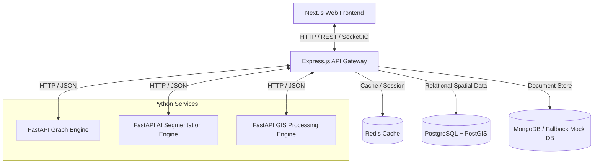

# RouteGuard AI — Global Mobility Intelligence & Disaster Decision Support Platform

RouteGuard AI is an enterprise-grade, production-ready Geospatial Decision Support System (DSS) and Digital Twin platform. It processes high-resolution satellite imagery (Cartosat, Sentinel, Landsat) to extract road topologies beneath heavy tree canopies, building shadows, and cloud occlusions. The platform heals fragmented network centerlines, builds routable transport graphs, integrates live NASA FIRMS active fire and GDACS flood feeds, and executes dynamic traffic-aware routing and city-wide resilience stress testing.

---

## 1. System Architecture



For a detailed design overview, see [docs/architecture.md](file:///c:/Users/ASUS/Desktop/pathshield/PathShield/docs/architecture.md).

---

## 2. Key Features

- **Global Geocoding & Search**: Real-time address and coordinates lookup powered by OpenStreetMap's Nominatim geocoder.
- **Dynamic Traffic Routing**: Direct integration of edge congestion multipliers (heavy, moderate, clear) and active construction incidents into Dijkstra routing paths.
- **NASA FIRMS & GDACS Overlays**: Live, visual hazard alert coordinates rendered as semi-transparent warning perimeters.
- **AI Mobility Copilot**: A floating glassmorphic chatbot supporting natural-language query routing (e.g. "What happens if a bridge fails?").
- **Smart City Planning AI**: Municipal planning simulator that evaluates ROI, costs, daily fuel savings, and resilience gains for new infrastructure.

---

## 3. Technology Stack

- **Frontend Dashboard**: Next.js 14, React, TypeScript, Leaflet, TailwindCSS, ShadCN UI
- **Backend API Gateway**: Node.js, Express.js, TypeScript, Socket.IO, JWT, Rate Limiter
- **Python Engines**: FastAPI, PyTorch, NetworkX, SciPy, GDAL, Rasterio, GeoPandas
- **Databases**: PostgreSQL + PostGIS, MongoDB, Redis Cache

---

## 4. Quick Start & Execution

### Prerequisites
- Node.js (v18+)
- Python (v3.10+)
- Docker & Docker Compose (for production)

### Local Launch (Development Mode)

1. **Start the API Gateway**:
   ```bash
   cd backend
   npm install
   npm run dev
   ```
   The gateway runs on [http://localhost:8000](http://localhost:8000).

2. **Start the Next.js Client**:
   ```bash
   cd frontend
   npm install
   npm run dev
   ```
   Access the dashboard UI at [http://localhost:3000](http://localhost:3000).

3. **Start Python Engines**:
   Configure a Python virtual environment and activate it:
   ```bash
   python -m venv .venv
   source .venv/bin/activate # Or .venv\Scripts\activate on Windows
   pip install -r requirements.txt
   ```
   Run the microservices:
   ```bash
   # Terminal 1: Graph Engine
   python graph-engine/main.py
   
   # Terminal 2: AI Engine
   python ai-engine/main.py
   
   # Terminal 3: GIS Engine
   python gis-engine/main.py
   ```

---

## 5. Running Verification Tests

To execute the backend gateway endpoint router tests (Jest):
```bash
cd backend
npm run test
```

To execute the graph topology and routing test cases (Pytest):
```bash
pytest tests
```

---

## 6. Docker Container Deployment

For unified deployment across development or staging domains:
```bash
docker-compose up --build -d
```
NGINX maps incoming requests to appropriate services, with Next.js serving traffic on port `3000` and the Express Gateway listening on port `8000`.