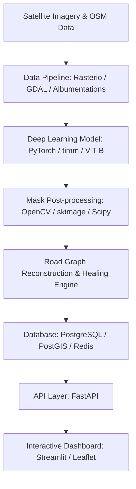

# Technical Stack Decision Document — Route Resilience

This document outlines and justifies the selected technologies for implementing the Route Resilience platform. Our choices balance computational efficiency, developer productivity, and robust geospatial intelligence standards.

---

## 1. Architectural Stack Selection

---

## 2. Core Stack Justifications

### A. Frontend Layer
*   **Selected Stack:** Next.js (TypeScript) / Streamlit (Prototype UI)
*   **Libraries:** Leaflet.js, MapLibre, Deck.gl, Tailwind CSS, Shadcn/UI
*   **Justifications:**
    *   *Streamlit* is selected for the rapid-prototyping dashboard due to its python-native environment, allowing direct integration with geospatial libraries (Folium/Leaflet) without API serialization overhead.
    *   *Leaflet.js* allows responsive rendering of spatial layers (nodes, edges, centrality heatmaps) inside the browser.
    *   *TypeScript / Tailwind / Shadcn* (in the next-stage full Next.js application) provide strict type safety for GeoJSON structures and clean, responsive UI layouts suitable for professional GIS operators.

### B. API & Backend Layer
*   **Selected Stack:** FastAPI
*   **Justifications:**
    *   FastAPI is built on ASGI (Starlette) and supports fully asynchronous endpoint execution, preventing blocking during slow DB queries.
    *   Automatic Pydantic integration enforces strict validation of geographical coordinates, bounding boxes, and node deletion payloads.
    *   Out-of-the-box OpenAPI (Swagger) generation facilitates automated client generation and API testing.

### C. Database Layer
*   **Selected Stack:** PostgreSQL + PostGIS (Persistent) & Redis (Cache)
*   **Justifications:**
    *   *PostGIS* is the industry standard for GIS databases. It provides spatial index acceleration (GiST index) and SQL functions (e.g., `ST_Contains`, `ST_Buffer`, `ST_DWithin`, `ST_Distance`) essential for identifying nearest node coordinates and cropping bounding-box subgraphs.
    *   *Redis* acts as a transient cache for routing paths. Shortest path recalculations (Dijkstra) between common source-target pairs are cached to bypass database queries entirely, keeping latency below 20ms.

### D. Deep Learning Framework
*   **Selected Stack:** PyTorch & timm (PyTorch Image Models)
*   **Justifications:**
    *   *PyTorch* offers dynamic computation graphs, making it straightforward to implement custom composite loss functions (Dice + IoU + Boundary + Connectivity losses) which require computing gradients on intermediate image convolutions.
    *   *timm* provides optimized, production-tested implementations of Vision Transformers (specifically `vit_base_patch32_384`) with pretrained ImageNet-21K weights. This eliminates the need to train transformer attention blocks from scratch.

### E. Graph & Spatial Analytics
*   **Selected Stack:** NetworkX & PyTorch Geometric (PyG)
*   **Libraries:** GDAL, Rasterio, GeoPandas, Shapely, Scikit-Image (skimage)
*   **Justifications:**
    *   *NetworkX* provides highly optimized Python algorithms for graph topology manipulation, Brandes Betweenness Centrality, and routing.
    *   *Rasterio & GDAL* wrap high-performance C++ geospatial engines to read/write multiband GeoTIFF coordinates, ensuring pixel coordinates align perfectly with latitude/longitude bounds.
    *   *Shapely & GeoPandas* handle vector geometry manipulations (LineStrings, Points) and coordinate reference system (CRS) projections (e.g., projecting from WGS84 to UTM zone 43N for metric distance calculations).
    *   *Scikit-Image* implements the Zhang-Suen thinning algorithm used in skeletonization.

### F. MLOps & DevOps
*   **Selected Stack:** MLflow, Docker, GitHub Actions
*   **Justifications:**
    *   *MLflow* tracks metric summaries (IoU, Dice, Recall) across epochs, logging hyperparameter sets, and archiving model checkpoints (`.pth`).
    *   *Docker* packages system-level dependencies (GDAL and PostGIS binaries) consistently. This ensures the execution environment is identical during training, local testing, and staging deployments.
