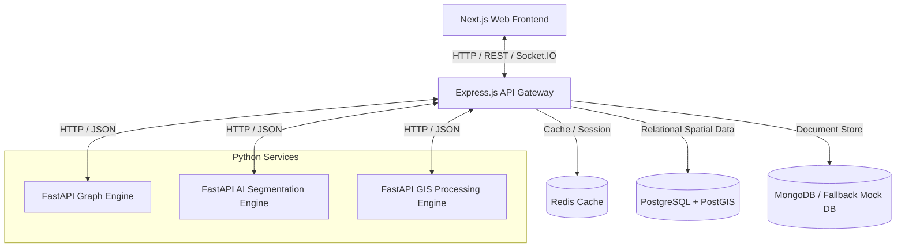

# RouteGuard AI — System Architecture & Component Design

This document details the modular multi-layered architecture of the RouteGuard AI platform.

## System Topology & Data Flow

## Layered Component Architectures

### 1. Data Ingestion & Storage Layer
- **PostgreSQL & PostGIS**: Manages spatial geometries (road centerline paths, hospital locations, flood zones).
- **MongoDB**: Used for storing unstructured or semi-structured node-link properties of cities.
- **In-Memory Fallback**: Actively seeds in-memory data if MongoDB/Postgres are unavailable, guaranteeing immediate system reliability.

### 2. AI Segmentation Layer
- Extracts road masks from high-resolution satellite inputs (Cartosat, Landsat, Sentinel-2).
- Utilizes Vision Transformers (ViT) and CNN backbones for occlusion-robust classification beneath canopy/building shadows.

### 3. Graph Intelligence & Healing Layer
- Converts binary road segmentation masks into topologically connected skeletons.
- Automatically repairs road segment gaps caused by building occlusion using angular alignment and distance heuristics.

### 4. Dynamic Mobility & Simulation Layer
- Updates travel times and routing parameters based on dynamic congestion weights.
- Conducts Monte Carlo stress tests and cascades failures to compute network-wide resilience metrics.
